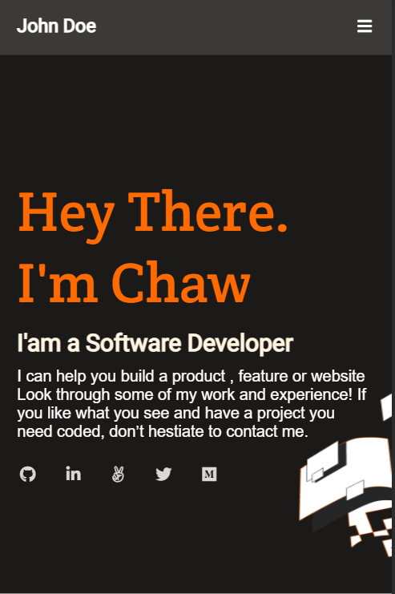
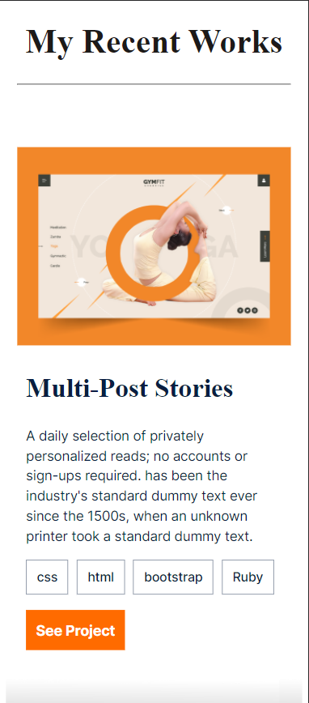
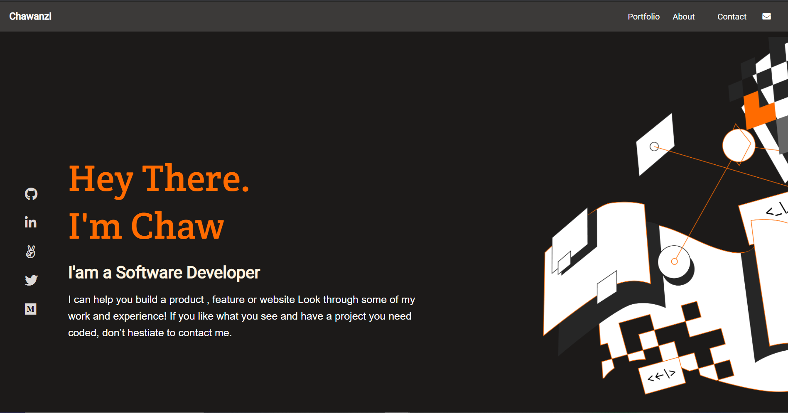

# Portfolio

> This is my first attempt at making my portfolio. 

Below, I have attached screenshots of the: 

Mobile Version.

Desktop Version

In this project I built a portifolio using a variety of CSS properties such us,
Flex-box, Grid, media queries, animations and transitions.

To this project I have added :
- A toolbar
- Social media icon
- A form 
- Button interactions like hover.

## Built With

- HTML
- CSS

## Getting Started

- Create a new repo
- Add a feature branch to the repo
- Add linters
- Add a git ignore file
- Add HTML & CSS files
- Open a pull request

## Authors

👤 **Author**

- GitHub: [@chaw-bot](https://github.com/chaw-bot)
- Twitter: [@chaw36422087](https://twitter.com/chaw36422087)

## 🤝 Contributing

Contributions, issues, and feature requests are welcome!

Feel free to check the [issues page](../../issues/).

## Show your support

Give a ⭐️ if you like this project!

## 📝 License

This project is [MIT](./MIT.md) licensed.
